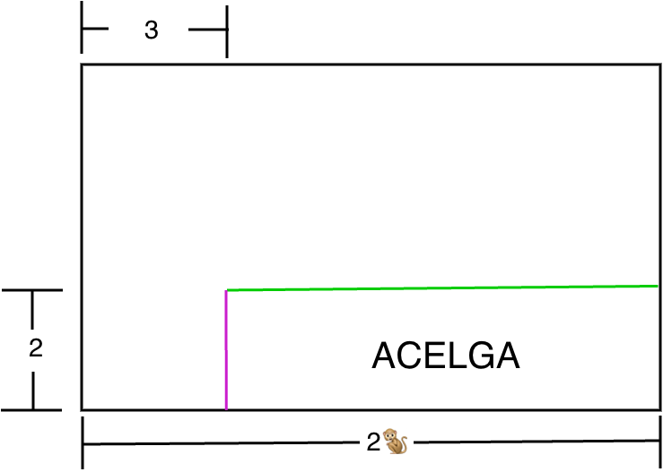
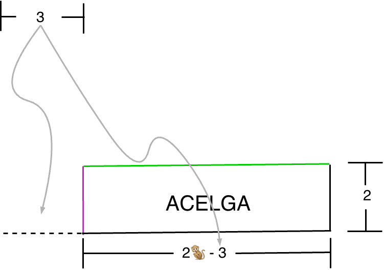

# Explicación del Huerto de José 🌱

José tiene un terreno grande con forma de rectángulo, y lo dividió en **4 pedazos** para sembrar verduras diferentes.

Así se ve el terreno:


Tenemos algunos datos pero no sabemos exactamente cuánto mide cada pedazo. Para eso, vamos a usar las pistas que nos da el dibujo.


Primero vamos a entender el terreno completo.


Antes de empezar, recuerda dos cosas importantes:

- **Ancho**: $2🐒$ (dos changuitos)

- **Alto**: $2 + ?$ (por ahora no nos preocupemos por el signo de interrogación, ya lo vamos a descubrir cuanto mide mas adelante)

¡Ahora vamos pedazo por pedazo!

---

## 🥬 1. La Acelga (abajo a la derecha)

La acelga está aquí:


### Paso 1: ¿Cuánto mide de alto?

Mira el lado izquierdo del dibujo. José cortó una línea horizontal (color verde). La parte de **abajo** mide **2**.

La acelga está abajo, entonces su alto es **2**. ¡Fácil!

```
         ┌────────────────────────┐  ─┬─
         │   parte de arriba      │   ?
         ├────────────────────────┤  ─┼─  ← aquí cortó
         │   parte de abajo       │   2
         └────────────────────────┘  ─┴─
```

### Paso 2: ¿Cuánto mide de ancho?

El terreno completo mide **$2🐒$** de ancho.

José cortó una línea vertical y el pedazo de la izquierda mide **3**.



Piensa así: si tienes una cuerda que todo mide $2🐒$ y le cortas un pedazo de $3$, ¿cuánto te queda?

$$2🐒 - 3$$

La acelga está a la **derecha**, entonces su ancho es $2🐒 - 3$.

```
         |<- 3 -->|<--- (2🐒 - 3) ---->|
         ┌────────┬──────────────────┐
         │   ya   │   lo que sobra   │
         │ usamos │     = 2🐒 - 3     │
         └────────┴──────────────────┘
         |<────────── 2🐒 ──────────>|
```

### Paso 3: Juntamos los dos lados

La acelga es un rectángulo con:

- **Alto** = $2$
- **Ancho** = $2🐒 - 3$


Ahora que ya tenemos las medidas de los lados, podemos calcular el área de la acelga.

El área de un rectángulo se calcula **ancho × alto**, entonces:

$$\text{Área de la acelga} = (2🐒 - 3)(2) = 4🐒 - 6$$

Entonces ya sabemos que 4 changuitos menos 6 es el área de la acelga. 

¡Vamos bien! 🎉
