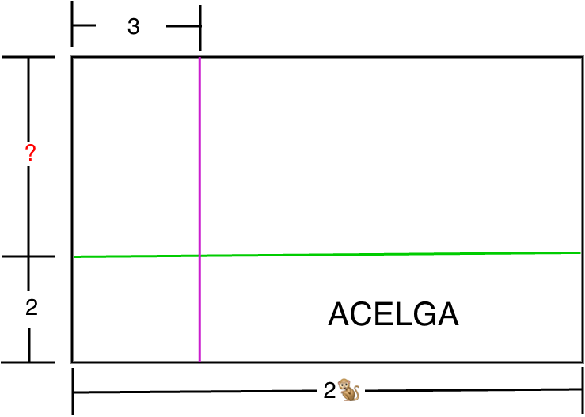
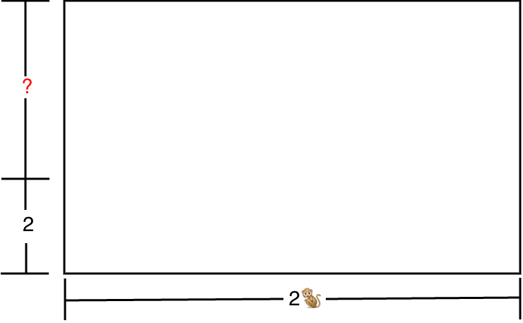

# Explicación del Brócoli 🥦

José tiene un terreno grande con forma de rectángulo, y lo dividió en **4 pedazos** para sembrar verduras diferentes.

Así se ve el terreno:


Tenemos algunos datos pero no sabemos exactamente cuánto mide cada pedazo. Para eso, vamos a usar las pistas que nos da el dibujo.



Primero vamos a entender el terreno completo.



Antes de empezar, recuerda dos cosas importantes:

- **Ancho**: $2🐒$ (dos changuitos)

- **Alto**: $2 + ?$ (por ahora no nos preocupemos por el signo de interrogación, ya lo vamos a descubrir cuánto mide más adelante)

¡Ahora vamos a ver el brócoli!

---

## 🥦 El Brócoli (arriba a la izquierda)

El brócoli está aquí:

```
         |<-- 3 -->|
         ┌─────────┬──────────────────────┐  ─┬─
         │         │                      │   │
         │ BROCOLI │                      │   ?
         │         │                      │   │
         ├─────────┼──────────────────────┤  ─┴─
         │         │                      │
         └─────────┴──────────────────────┘
```

El brócoli está en la **esquina de arriba a la izquierda**.

### Paso 1: ¿Cuánto mide de ancho?

José cortó una línea vertical. Mira la parte de arriba del dibujo. El pedazo de la **izquierda** mide **3**.

```
         |<-- 3 -->|
         ┌─────────┬──────────────────┐
         │         │                  │
         │ BROCOLI │                  │
         │ (ancho  │                  │
         │  = 3)   │                  │
         └─────────┴──────────────────┘
```

El brócoli está a la **izquierda**, entonces su ancho es **3**. ¡Fácil!

### Paso 2: ¿Cuánto mide de alto?

El brócoli está en la parte de **arriba** del terreno.

Mira el lado izquierdo del dibujo. José cortó una línea horizontal (color verde). La parte de **abajo** mide **2**.

Pero el brócoli está **arriba**, no abajo. ¿Entonces cuánto mide de alto?

```
         ┌────────────────────────┐  ─┬─
         │   BRÓCOLI está aquí    │   ?  ← ¿cuánto es esto?
         ├────────────────────────┤  ─┼─  ← aquí cortó
         │   abajo                │   2  ← esto sí sabemos
         └────────────────────────┘  ─┴─
```

Pista: El terreno completo mide $2 + ?$ de alto.

Si el pedazo de abajo mide **2**, y le sumamos el pedazo de arriba que mide **?**, nos da el total:

$$2 + ? = \text{alto total}$$

¿Qué crees que es el signo de interrogación **?**?

¡Es **🐒**! (un changuito)

Entonces el alto del brócoli es **🐒**.

```
         ┌────────────────────────┐  ─┬─
         │   BRÓCOLI              │   🐒
         ├────────────────────────┤  ─┼─
         │   abajo                │   2
         └────────────────────────┘  ─┴─
                                      2 + 🐒 (total)
```

### Paso 3: Juntamos los dos lados

El brócoli es un rectángulo con:

- **Alto** = $🐒$
- **Ancho** = $3$

Ahora que ya tenemos las medidas de los lados, podemos calcular el área del brócoli.

El área de un rectángulo se calcula **ancho × alto**, entonces:

$$\text{Área del brócoli} = (3)(🐒) = 3🐒$$

Esto se lee: "3 por un changuito es igual a 3 changuitos"

Entonces ya sabemos que **3 changuitos** es el área del brócoli. 🥦✨

---

## 🎯 Resumen

| **Lo que buscamos** | **Respuesta** |
|---------------------|---------------|
| ¿Dónde está? | Arriba a la izquierda |
| Alto | $🐒$ |
| Ancho | $3$ |
| Área | $3🐒$ |

**Dato curioso:** El brócoli tiene un lado con número normal (3) y otro lado con un changuito (🐒). Por eso su área es $3🐒$, que es más fácil que el jitomate pero tiene más changuitos que la cebolla.

¡Fantástico trabajo! 🌟
