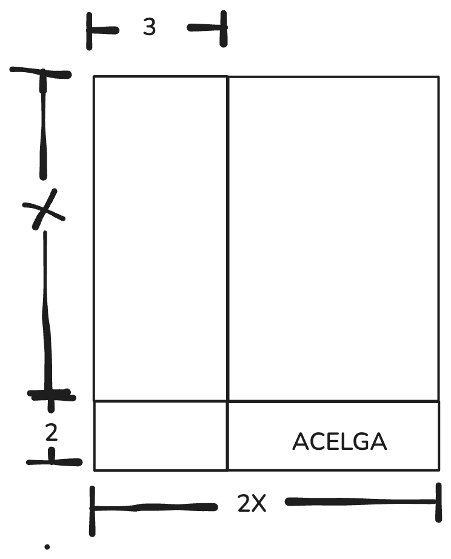

Jose tiene un huerto donde sembro los alimentos que se muestran en la figura.

## Diagrama del Huerto


```
    │← 3 →│
  - ┌─────┬─────────────────────┐
  │ │     │                     │
  │ │     │                     │
  x │     │                     │
  │ │     │                     │
  │ │     │                     │
  ─ ├─────┼─────────────────────┤
  ↑ │     │                     │
  2 │     │      ACELGA         │
  ↓ │     │                     │
  ─ └─────┴─────────────────────┘
    │←---------- 2x -----------→│
```

## Tabla de productos sembrados en el huerto:

| Producto | Dimensiones |
|----------|-------------|
| Jitomate | $(2x-3)(x)$ |
| Cebolla  | $(3)(2)$    |
| Acelga   | $(2x-3)(2)$ |
| Brócoli  | $(3)(x)$    |
